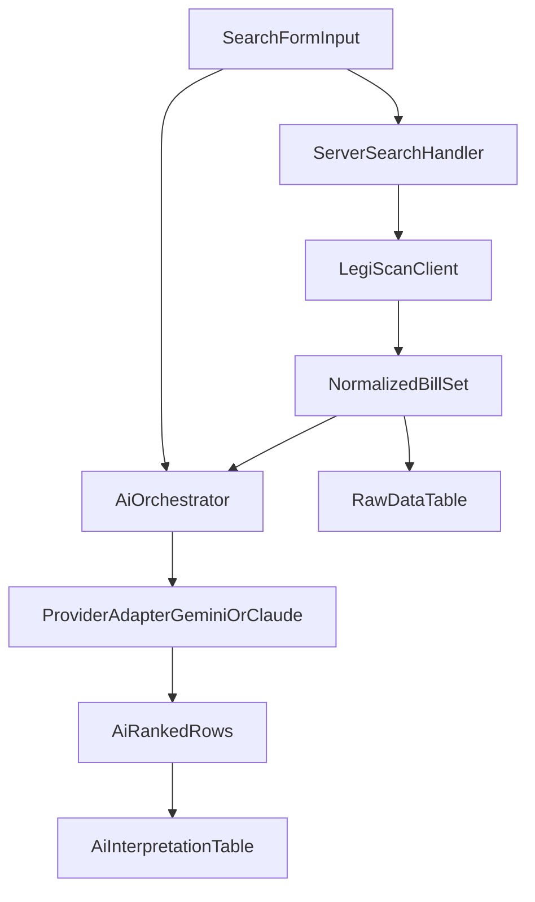

# Legislative Review Implementation Plan

## Confirmed Decisions

- AI architecture: unified provider layer (Gemini + Claude adapters behind one internal interface).
- Key handling (v1): user-provided AI key per request/session (not persisted); LegiScan key stored server-side in environment variables.
- AI safety posture (v1): balanced-refuse on server side (refuse unsafe/misuse requests while allowing normal in-scope analysis).
- Rate limiting (v1): Upstash-backed, IP-only initially, balanced profile `30 requests / 10 minutes`.
- CI/CD auth to AWS: GitHub Actions via OIDC-assumed IAM role (no long-lived AWS keys in GitHub secrets).

## Phase Checklist

- [ ] Phase 1 - Foundation + Contracts
- [ ] Phase 2 - LegiScan Server Integration
- [ ] Phase 3 - Unified AI Layer (Gemini + Claude)
- [ ] Phase 4 - Search Form + Submission UX
- [ ] Phase 5 - Raw LegiScan Data Table
- [ ] Phase 6 - AI Interpretation Table + Accordion Rows
- [ ] Phase 7 - Full-Text Enrichment (v1.1)
- [ ] Phase 8 - Hardening + Quality Pass
- [ ] Phase 9 - Deployment (AWS App Runner + ECR)
- [ ] Phase 10 - CI/CD Automation (GitHub Actions -> ECR -> App Runner)

## Research Notes

### LegiScan operations needed now

- `getSearch` supports `state`+`query` (or `id`+`query` for session search), optional `year`, optional `page`.
- `getBill` returns detailed bill records used for summary/title/status/links.
- `getBillText` returns base64 `doc` payload; v1 uses summary fields, and v1.1 decodes/extracts full text for Top 10 bills.

### Concrete response contracts

#### `getSearch` (`status`, `searchresult`)

- Supported input parameter sets:
  - Invocation A (statewide/national):
    - `state`: state abbreviation or `ALL`
    - `query`: URL-encoded full text query
    - `year` (optional): `1`=all, `2`=current (default), `3`=recent, `4`=prior, `>1900`=exact year
    - `page` (optional): result page (default `1`)
  - Invocation B (single session):
    - `id`: specific `session_id`
    - `query`: URL-encoded full text query
    - `page` (optional): result page (default `1`)
- Response envelope:
  - `status` (`OK` on success)
  - `searchresult` object
- `searchresult.summary`:
  - `page`, `range`, `relevancy`, `count`, `page_current`, `page_total`
- `searchresult.<index>` row fields:
  - `relevance`, `state`, `bill_number`, `bill_id`, `change_hash`
  - `url`, `text_url`, `research_url`
  - `last_action_date`, `last_action`, `title`
- Notes:
  - `searchresult` is keyed by `summary` and numeric string keys (`"0"`, `"1"`, ...), not a plain array.
  - `getSearch` does not provide full bill detail collections; use `getBill` for details.

#### `getBill` (`status`, `bill`)

- Input parameters:
  - `id` (required): retrieve bill information for `bill_id` as given by `id`
- Response envelope:
  - `status` (`OK` on success)
  - `bill` object
- Bill scalar fields (from provided sample):
  - `bill_id`, `change_hash`, `session_id`
  - `url`, `state_link`, `completed`
  - `status`, `status_date`
  - `state`, `state_id`
  - `bill_number`, `bill_type`, `bill_type_id`
  - `body`, `body_id`, `current_body`, `current_body_id`
  - `title`, `description`, `pending_committee_id`
- Bill nested objects/arrays (from provided sample):
  - `session`: `session_id`, `state_id`, `year_start`, `year_end`, `prefile`, `sine_die`, `prior`, `special`, `session_tag`, `session_title`, `session_name`
  - `committee`: `committee_id`, `chamber`, `chamber_id`, `name`
  - `progress[]`: `date`, `event`
  - `referrals[]`: `date`, `committee_id`, `chamber`, `chamber_id`, `name`
  - `history[]`: `date`, `action`, `chamber`, `chamber_id`, `importance`
  - `sponsors[]`: `people_id`, `person_hash`, `party_id`, `party`, `role_id`, `role`, `name`, `first_name`, `middle_name`, `last_name`, `suffix`, `nickname`, `district`, `ftm_eid`, `votesmart_id`, `opensecrets_id`, `knowwho_pid`, `ballotpedia`, `sponsor_type_id`, `sponsor_order`, `committee_sponsor`, `committee_id`
  - `sasts[]`: `type_id`, `type`, `sast_bill_number`, `sast_bill_id`
  - `subjects[]`: `subject_id`, `subject_name`
  - `texts[]`: `doc_id`, `date`, `type`, `type_id`, `mime`, `mime_id`, `url`, `state_link`, `text_size`, `text_hash`
  - `votes[]`: `roll_call_id`, `date`, `desc`, `yea`, `nay`, `nv`, `absent`, `total`, `passed`, `chamber`, `chamber_id`, `url`, `state_link`
  - `amendments[]`: `amendment_id`, `adopted`, `chamber`, `chamber_id`, `date`, `title`, `description`, `mime`, `mime_id`, `url`, `state_link`, `amendment_size`, `amendment_hash`
  - `supplements[]`: `supplement_id`, `date`, `type`, `type_id`, `title`, `description`, `mime`, `mime_id`, `url`, `state_link`, `supplement_size`, `supplement_hash`
  - `calendar[]`: `type_id`, `type`, `date`, `time`, `location`, `description`

#### `getBillText` (`status`, `text`)

- Input parameters:
  - `id` (required): retrieve bill text information for `doc_id` as given by `id`
- Response envelope:
  - `status` (`OK` on success)
  - `text` object
- `text` fields:
  - `doc_id`, `bill_id`, `date`
  - `type`, `type_id`
  - `mime`, `mime_id`
  - `text_size`, `text_hash`
  - `doc` (base64-encoded document bytes; often PDF/Word)

## Phase-by-Phase Execution

Each phase ends with review/sign-off before proceeding.

### Phase 1 - Foundation + Contracts

- Build domain contracts (types/schemas/interfaces) for:
  - search input, normalized LegiScan bill row, AI ranking output row
  - provider-agnostic AI interface (`analyzeBills`) and adapter contract
- Add shared validation and guardrails for user context length/content.
- Add/update unit tests for schema validation and interface behavior.
- Sign-off checkpoint: confirm data model + API contracts before wiring network calls.
- Primary files:
  - `implementation.md`
  - `app/(app)/search/page.tsx`
  - New lib contracts under project root, e.g. `lib/domain/*`, `lib/ai/*`

### Phase 2 - LegiScan Server Integration

- Implement server-side LegiScan client module and API route/action:
  - input validation, timeout/retry behavior, error normalization
  - call `getSearch`, then fan-out to `getBill` details (bounded concurrency)
  - normalize LegiScan payload to app schema used by UI and AI pipeline
- Implement application-enforced rate limiting with Upstash store:
  - per-IP sliding-window checks in application logic (fine-tunable policy layer)
  - default profile: `30 requests / 10 minutes` per IP
  - standardized `429` response shape with retry guidance
- Add integration tests with mocked LegiScan responses.
- Sign-off checkpoint: verify search behavior, mapping quality, and failure handling.
- Primary files:
  - New server modules under `lib/legiscan/*`
  - New API endpoints under `app/api/*` (or server action modules)
  - Tests under project conventions

### Phase 3 - Unified AI Layer (Gemini + Claude)

- Implement provider abstraction:
  - provider registry, `GeminiAdapter`, `ClaudeAdapter`, default model selection
  - structured output schema for ranking (`relevanceScore`, `relevanceReason`, bill references)
- Add safeguards:
  - server-side system policy prompt that enforces product scope and misuse protections
  - balanced-refuse policy for disallowed requests (prompt-injection attempts, secret exfiltration attempts, unsafe repurposing attempts)
  - output validation against strict schema; reject/repair invalid AI responses
  - explicit disallow path for image/content generation unrelated to legislative analysis
  - redact sensitive values from prompts/logs/errors; never echo secrets back in model output
- Add tests:
  - provider selection and schema-safe parsing
  - refusal behavior and prompt-injection resistance
- Sign-off checkpoint: validate ranking quality and consistent output across engines.
- Primary files:
  - New modules under `lib/ai/*`
  - Server endpoint/action wiring to call unified AI service

### Phase 4 - Search Form + Submission UX

- Build the first working app shell under route group `app/(app)`:
  - state dropdown (50 states + All States + US Congress)
  - full text search input
  - AI engine dropdown (Gemini, Claude)
  - optional model dropdown (engine-specific defaults)
  - AI key input (transient)
  - user context textarea with guardrails
- Implement pending/loading/error states and client-side validation.
- Sign-off checkpoint: validate form UX and request lifecycle.
- Primary files:
  - `app/(app)/search/page.tsx`
  - New UI components under `app/(app)/_components/*`
  - Keep `app/(marketing)` for landing and non-application content only

### Phase 5 - Raw LegiScan Data Table

- Build raw data table from normalized results with stable columns:
  - bill number, title, status, status date, summary snippet, bill link, text link
- Add sorting and empty-state handling.
- Keep rows lightweight and pagination-ready.
- Sign-off checkpoint: confirm raw table columns/ordering and data accuracy.

### Phase 6 - AI Interpretation Table + Accordion Rows

- Build AI ranking table (most to least relevant):
  - relevance score (1-100), reason (max 2 sentences), title, summary, links, status
- Add row accordion behavior with truncated summary + expanded full summary.
- Add mismatch handling when AI references unknown bill IDs.
- Sign-off checkpoint: confirm ranking presentation and accordion behavior.

### Phase 7 - Full-Text Enrichment (v1.1)

- Add a second-pass ranking enrichment pipeline after initial summary-based ranking:
  - select the Top 10 ranked bills
  - fetch `getBillText` payloads for those bills
  - decode base64 server-side and extract plain text from supported document formats
  - re-rank Top 10 with full text + prior summary metadata
- Safeguards:
  - bounded concurrency and per-doc size limits
  - fallback to summary-only ranking when text extraction fails
  - no logging or persistence of raw full-text payloads
- Sign-off checkpoint: validate quality improvement vs latency/cost trade-off.

### Phase 8 - Hardening + Quality Pass

- End-to-end polish:
  - full error paths, observability hooks, edge-case handling, accessibility review
  - final lint/typecheck/tests
- Documentation pass in `implementation.md`:
  - architecture notes, endpoint contracts, provider extension guide, known limitations
- Sign-off checkpoint: release-readiness review.

### Phase 9 - Deployment (AWS App Runner + ECR)

- Add containerized deployment setup:
  - production-ready Dockerfile for Next.js runtime
  - image tagging strategy and push flow to AWS ECR
- Add App Runner service configuration:
  - App Runner service connected to ECR repository
  - automatic redeploy on new image push
  - runtime environment/secrets configuration for LegiScan/Upstash and app settings
- Add DNS/domain verification:
  - verify whether App Runner created Route 53 records automatically
  - if not present, create required Route 53 DNS records manually
- Add deployment runbook content in documentation:
  - build, push, deploy, rollback, DNS verification
- Sign-off checkpoint: confirm production deployment and DNS routing behavior.

### Phase 10 - CI/CD Automation (GitHub Actions -> ECR -> App Runner)

- Add GitHub Actions workflow triggered on merge/push to `main`.
- Enforce quality gate before image publish:
  - run typecheck/lint/tests first
  - stop pipeline if any checks fail
- On successful checks:
  - build Docker image
  - authenticate to AWS using GitHub OIDC role assumption
  - push image to AWS ECR with deterministic tags (commit SHA + `latest` if policy allows)
- Ensure App Runner auto-redeploy flow is wired to new ECR image pushes.
- Add workflow safeguards:
  - branch protection expectation for `main`
  - least-privilege IAM permissions for ECR push and required App Runner interactions
- Document CI/CD runbook:
  - required GitHub variables/secrets (no static AWS credentials)
  - OIDC role setup steps
  - troubleshooting for failed test gate/push
- Sign-off checkpoint: verify end-to-end automation from merge-to-main through deployment.

## Proposed Defaults and Constraints

- Start with server-side fetch orchestration; avoid exposing LegiScan server key to client.
- Keep AI key transient (in-memory request scope only), never persisted or logged.
- Use strict TypeScript typing + runtime validation at all external boundaries.
- Keep each phase small and mergeable, with tests per phase.
- Full-text enrichment default: always run on Top 10 bills in v1.1.
- Rate limiting default: Upstash-backed `30 requests / 10 minutes` per IP; user-based limits added in a follow-up phase.
- Deployment target: AWS App Runner using Docker images in AWS ECR with auto redeploy on image updates.
- CI/CD target: GitHub Actions runs tests before Docker build/push and uses OIDC-based AWS auth.

## Architecture Sketch

## Review Workflow

- Stop after each phase and request explicit approval before moving to the next one.
- If requirements shift at any checkpoint, revise only upcoming phases unless rework is explicitly requested.
